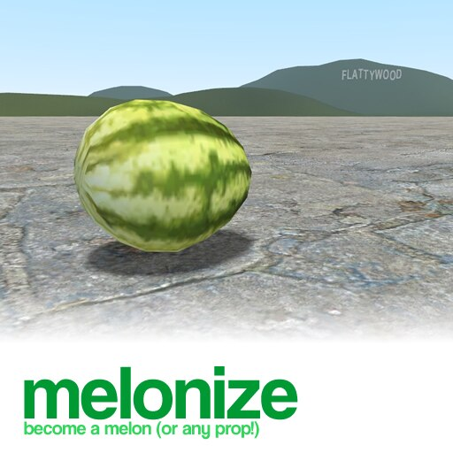
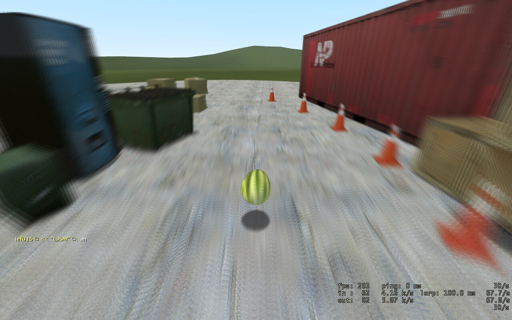
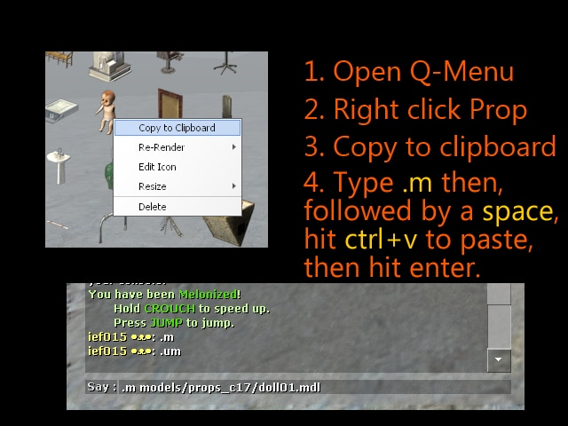

# Melonize

A Garry's Mod addon which allows players to become a melon, or any other prop.

Subscribe from Steam Workshop here:
https://steamcommunity.com/sharedfiles/filedetails/?id=110958085

Originally written in 2012-2013. Functionality is not guaranteed.

# License (Common Sense)

You may freely use or modify for your own server, addons, and software.

- The origin of this software must not be misrepresented.
- Do not claim you have wrote the original software.
- Do not republish the original software.

When publishing a new addon or modification using modified code of this software, it would be highly appreciated (though not required) if you credit the original author and link back to the original software located here: https://steamcommunity.com/sharedfiles/filedetails/?id=110958085 (The GitHub repository page is fine, too.)

# Mod Description

Type `.m` in the chatbox to turn yourself into a melon, or any prop!
Inspired by The Mathias' Melonizer addon, this addon adds on to it, providing more customization.

The server must have this addon installed in order to work!

## Console commands

### Client commands:

`melonize [modelname]` Melonize yourself. Modelname is optional.
`unmelonize` Unmelonize yourself.
`melonizePlayer ply [modelname]` Melonize another player. Admin only. Ply is the player's nickname. Modelname is optional.
`unmelonizePlayer ply` Unmelonize another player. Admin only. Ply is the player's nickname.

### Server commands:

`sv_melonize 0/1` Disable/enable melonizer. Enabled by default.
`sv_melonize_adminonly 0/1` When enabled, only admins may melonize. Disabled by default.

### Chat commands:

The following commands are typed in the CHAT BOX:
(Note: Remember to include the . period!)

`.m` or `.melonize` - Turn yourself into a melon.
You may specify a model and you'll become that instead of a melon!

Ex: `.m models/props_c17/oildrum001.mdl` Will turn you into an oil drum. (You can use the Q menu to find these model names too!)

`.um` or `.unmelonize` - Return to being a player again.

As a melon/prop (via melonize), the following commands are available to you:

`.weight` - Tells you how much your model weighs.
`.weight n` - Set your weight to n. (n is a number) Eg: .weight 1000 would make you very heavy.

`.color` - Tells you what colour you are.
`.colour` - ^
`.color r g b [a]` - Set colour of your melon/prop. Alpha is optional. RGBA values range from 0-255.
`.colour r g b [a]` - ^ Ex: .color 255 0 255 would make you turn purple.

`.material` - Tells you what your material is.
`.material mat` - Set your material. mat is a string representing a material.

